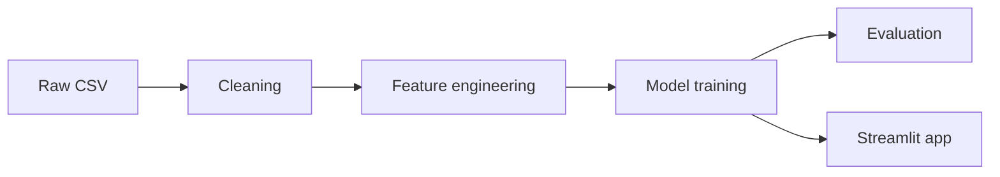

# Telecom Customer Churn

Predicting which telecom customers are likely to churn, using the IBM
sample Telco Customer Churn dataset, with the aim of surfacing insights
that could inform a retention program.

> **Status: early / in progress.** This is a side project being built up
> in phases (see [Roadmap](#roadmap) below). At this point the repo holds
> the dataset and the project plan — data cleaning, modelling, and the
> app haven't been built yet.

## About

Each row in the dataset represents one customer, with attributes on:

- **Services** — phone, multiple lines, internet, online security/backup,
  device protection, tech support, streaming TV/movies
- **Account info** — tenure, contract type, payment method, paperless
  billing, monthly/total charges
- **Demographics** — gender, senior citizen status, partner, dependents
- **Target** — `Churn`: whether the customer left in the last month

7,043 customers, 21 columns, ~26.5% churn rate.

## Repository structure

```
Telecom-customer-churn/
├── WA_Fn-UseC_-Telco-Customer-Churn.csv   # the dataset
├── spec/                                   # project plan and specs
│   ├── 00-project-roadmap.md               # phased task breakdown
│   ├── 01-system-architecture.md           # system design (data → app)
│   └── TEMPLATE.md                         # spec template for new work
├── journal/
│   └── agent-journal.md                    # running log of decisions made
└── .claude/skills/                         # AI-assisted workflow roles
    (planner, developer, test, review, reflection,
     risk-assessor, adversarial-review, data)
```

## Roadmap

Full detail in [`spec/00-project-roadmap.md`](spec/00-project-roadmap.md).
At a glance, the project moves through four phases:

1. **Setup & EDA** — environment, explore the raw data
2. **Cleaning & feature engineering** — fix data quirks, encode features
3. **Modelling** — train/test split, baseline, then a stronger model
4. **Evaluation & delivery** — metrics, interpretation, and (optionally)
   a Streamlit app for interactive predictions

None of these are complete yet — this README will be updated as they land.

## Architecture (high level)

The intended shape of the finished system, kept deliberately brief here —
full reasoning and diagrams are in
[`spec/01-system-architecture.md`](spec/01-system-architecture.md).



## How this project is organized

Work follows a spec-first workflow: a short spec is written in `spec/`
before non-trivial implementation, decisions and open questions get
logged in `journal/agent-journal.md`, and `.claude/skills/` defines the
roles (planner, developer, test, review, reflection, and a couple of
project-specific ones) used when working with an AI coding assistant on
this repo.

## Getting started

Right now there's no code to run yet — just the dataset and the plan.
Once implementation starts, this section will cover environment setup
and how to reproduce the pipeline; track progress via the roadmap above.
