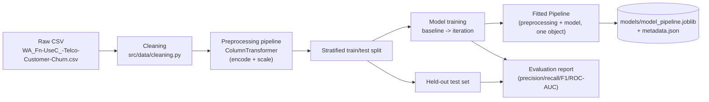
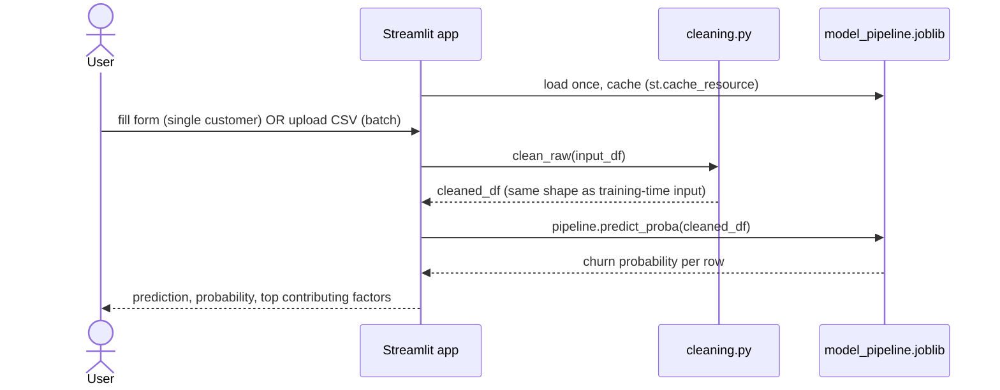
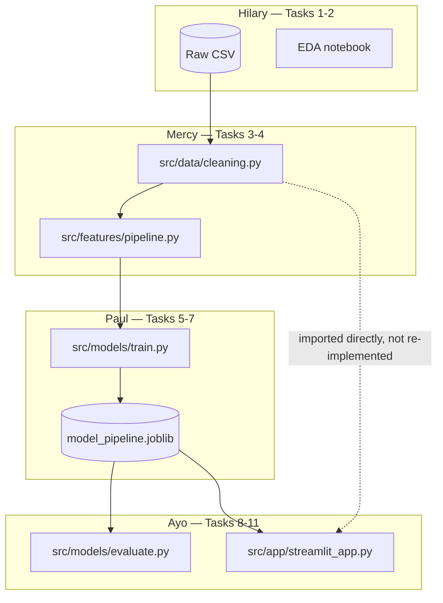
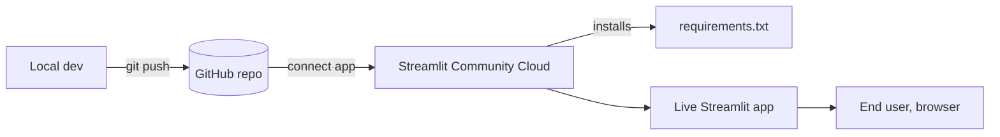

# Spec: System architecture — data cleaning to Streamlit deployment

Date: 2026-07-15

Companion to `spec/00-project-roadmap.md`. That file says *what* and *why*
for each phase; this file says how the phases fit together as one system,
and designs Task 11 (the stretch deliverable) properly instead of leaving
it as "a dashboard demo, vague."

## Goal

Define the shape of the system end to end — from the raw CSV to a
Streamlit app a non-technical user can open and get a churn prediction
from — so that Hilary/Mercy/Paul's artefacts compose cleanly into Ayo's
app instead of needing to be reconciled at the end.

## The core design decision

Everything else here follows from one rule:

> **Cleaning and feature encoding are fit once, at training time, and
> serialized together with the model as a single artifact.** The
> Streamlit app never re-implements or re-derives them — it loads that
> one artifact and calls `.predict_proba()`.

This matters because the most common way these small projects break in
practice is **train/serve skew**: the notebook that trained the model
cleans and encodes data one way, and the app that serves predictions
does it slightly differently (a forgotten category collapse, a scaler
fit on the wrong data, a column order mismatch) — accuracy silently
degrades and nobody's notebook catches it because the notebook was never
wrong. Using one saved `sklearn.Pipeline` for both training and inference
makes that class of bug structurally impossible rather than something to
remember.

## Repository layout

```
Telecom-customer-churn/
├── WA_Fn-UseC_-Telco-Customer-Churn.csv   # raw data (already committed)
├── requirements.txt
├── src/
│   ├── data/
│   │   └── cleaning.py        # clean_raw(df) — single source of truth
│   ├── features/
│   │   └── pipeline.py        # build_preprocessing_pipeline()
│   ├── models/
│   │   ├── train.py           # clean -> split -> fit -> save artifact
│   │   └── evaluate.py        # metrics report from the saved artifact
│   └── app/
│       └── streamlit_app.py   # the UI
├── models/
│   ├── model_pipeline.joblib  # ONE artifact: preprocessing + classifier
│   └── metadata.json          # training date, git commit, metrics snapshot
├── notebooks/                 # EDA and exploration (Hilary, Paul)
├── spec/, journal/, manuals/, .claude/skills/   # already in place
```

`src/data/cleaning.py` is imported by both `train.py` and
`streamlit_app.py` — that's what makes the "fit once" rule actually
hold, rather than being a rule people have to remember to follow.

## Training-time data flow



Note that the `ColumnTransformer` (encoding + scaling) is wrapped
*inside* the same `Pipeline` as the classifier, fitted in one `.fit()`
call, and saved as one `.joblib` file — not as separate encoder/scaler/
model files that have to be loaded and applied in the right order by
hand later.

## Runtime flow (Streamlit app)



Two input modes share the same code path: a form for a single customer
and a CSV upload for many. Both end up as a small DataFrame passed through
the identical `clean_raw` → `pipeline.predict_proba` calls — one path to
maintain, not two.

## Component ownership

Maps the architecture onto the existing task split so it's obvious where
each piece is built (see `spec/workload-*.md` for the full task detail).



The dotted line is the important one: Ayo's app **imports**
`clean_raw` from Mercy's module rather than writing its own version of
"drop customerID, fix TotalCharges." If the app needs a cleaning step
that doesn't exist yet, that's a sign the step belongs in
`cleaning.py`, not in the app.

## Streamlit app design

- **Single-customer form**: widgets constrained to valid values —
  `st.selectbox` for every categorical column (populated from the
  training data's known categories, not free text), `st.number_input`
  with min/max bounds from the training distribution for `tenure`,
  `MonthlyCharges`. This makes most bad input structurally impossible
  rather than something to validate after the fact.
- **Batch mode**: `st.file_uploader` accepting a CSV with the same raw
  columns as the training data (minus `Churn`); reuses the identical
  `clean_raw` → `predict_proba` path, returns a downloadable results CSV.
- **Output**: predicted label, probability, and the model's top-N
  feature importances re-expressed as plain language (from Ayo's Task 9
  interpretation work) — not just a bare number.
- **Caching**: load `model_pipeline.joblib` once via
  `st.cache_resource`, not on every interaction.
- **Unseen categories**: build the `OneHotEncoder` in
  `features/pipeline.py` with `handle_unknown="ignore"` so a category
  present at inference but not seen at training doesn't crash the app —
  it degrades to "unknown," not a stack trace in front of a user.

```python
# src/app/streamlit_app.py — skeleton
import streamlit as st
import joblib
import pandas as pd
from src.data.cleaning import clean_raw

@st.cache_resource
def load_pipeline():
    return joblib.load("models/model_pipeline.joblib")

pipeline = load_pipeline()

with st.form("customer"):
    tenure = st.number_input("Tenure (months)", 0, 72, 12)
    contract = st.selectbox("Contract", ["Month-to-month", "One year", "Two year"])
    # ... remaining fields, one widget per raw column
    submitted = st.form_submit_button("Predict")

if submitted:
    raw = pd.DataFrame([{"tenure": tenure, "Contract": contract, ...}])
    cleaned = clean_raw(raw)
    proba = pipeline.predict_proba(cleaned)[0, 1]
    st.metric("Churn probability", f"{proba:.0%}")
```

## Deployment

Two options, in order of how much this project actually needs:

1. **Streamlit Community Cloud (recommended)** — push to GitHub, connect
   the repo at share.streamlit.io, point it at
   `src/app/streamlit_app.py`, it reads `requirements.txt` and deploys.
   Free, zero infrastructure to maintain, matches "bootcamp side
   project" scope.
2. **Docker (only if hosting elsewhere is required)**:
   ```dockerfile
   FROM python:3.11-slim
   WORKDIR /app
   COPY requirements.txt .
   RUN pip install -r requirements.txt
   COPY . .
   CMD ["streamlit", "run", "src/app/streamlit_app.py", "--server.port=8501"]
   ```



## Risks specific to this architecture

- **Schema drift**: if the raw CSV's columns or category values change
  later, the pipeline and the Streamlit form's `selectbox` options both
  need updating together — they read from the same training data, so
  regenerate both from it rather than hand-editing the form.
- **Model staleness**: there's no retraining trigger. Retraining means
  re-running `train.py` and replacing `model_pipeline.joblib` — document
  this manual step in the README rather than implying it's automatic.
  Flag via `risk-assessor` if this project ever moves past a demo.
  `metadata.json` (training date, commit hash, headline metrics) exists
  so a stale model is at least detectable, not silent.
- **No auth on Streamlit Community Cloud**: fine here since the dataset
  is public/synthetic and there's no real customer PII — would need
  revisiting (`compliance` skill) if that ever changes.

## Success / acceptance criteria

- `src/models/train.py` runs end to end and produces
  `models/model_pipeline.joblib`.
- `src/app/streamlit_app.py` runs locally (`streamlit run ...`) and
  produces a prediction for both a manually filled form and an uploaded
  CSV, using nothing but the saved pipeline and `clean_raw`.
- The app is reachable at a public URL (Streamlit Community Cloud) or,
  at minimum, documented as runnable via Docker.

## Relationship to the roadmap

This spec designs Task 11 from `spec/00-project-roadmap.md` (currently
"stretch/optional") and formalizes the `models/` artifact that Task 7
(Paul) hands to Task 8 (Ayo). It doesn't change what's required for the
project's core success criteria — deployment stays optional unless the
team decides otherwise.
